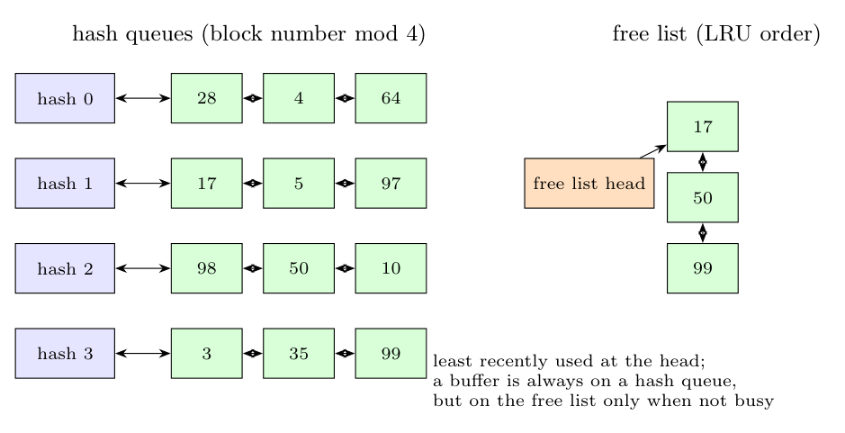

**Structure of the buffer list.** The kernel keeps a pool of buffers, each with a header. The headers are organised in two ways:

- **Hash queues:** doubly linked circular lists; the buffer for block $b$ of device $d$ is on the queue selected by a hash function of $(d, b)$ (e.g. block number mod number of queues). A buffer is **always** on a hash queue.
- **Free list:** a doubly linked circular list of buffers that are **not busy**, ordered by *least recently used* (a buffer is added at the tail when released and taken from the head). A buffer is on the free list only while it is not locked.

**Delayed write.** When a process writes a block, the kernel often does not write it to disk at once but marks the buffer *delayed write* and releases it. If `getblk` needs a new buffer (block not in the cache) and takes a buffer from the head of the free list that is marked delayed write (scenario 3), the kernel cannot reuse it yet: it starts an **asynchronous write** of that buffer to disk and **continues searching** for another free buffer (the delayed-write buffer is put at the head of the free list after the write completes). So the requesting process is **not given that buffer**; it takes the next free buffer, or, if no clean buffer is available, it **sleeps** until a write finishes or another buffer becomes free. (If the *requested block itself* is in the cache marked delayed write and is not busy, the process simply gets that buffer: a cache hit.)
