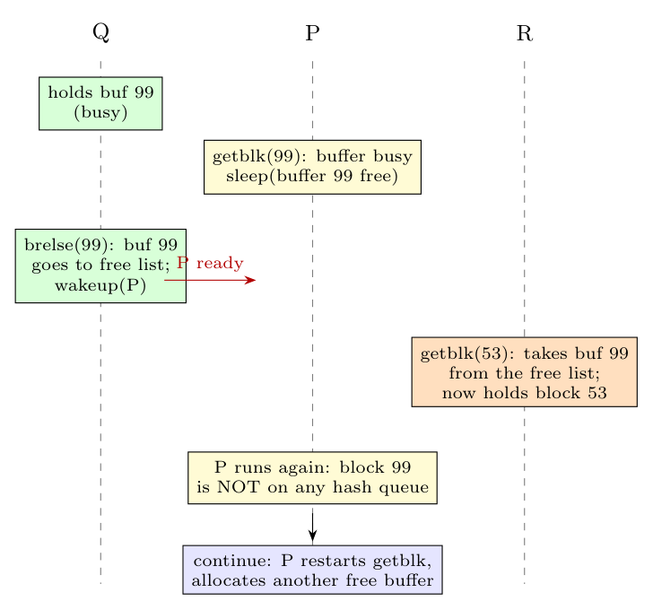

**Yes, it is possible.** `brelse` only makes the sleeping process *ready to run*; P does not run immediately and the kernel does not reserve the buffer for it. In the meantime another process can take the (now free) buffer:

1. P calls `getblk(99)`; block 99 is in the cache but its buffer is busy (used by Q). P marks the buffer as wanted and **sleeps** (scenario 5).
2. Q finishes and calls `brelse`: the buffer goes to the **free list** and **P is woken** (placed on the run queue, but not yet running).
3. Before P runs, a third process R calls `getblk(53)`, finds the free list non-empty, takes **buffer 99 from the free list**, removes it from its old hash queue and puts it on the hash queue of block 53 (scenario 2). The buffer no longer contains block 99.
4. P finally runs: **block 99 is not in any hash queue any more**; it cannot use the buffer it was waiting for.

That is exactly why `getblk` is written as a **loop** (`while (buffer not found)`): after being woken, P executes `continue`, searches the hash queue again, does not find block 99, and allocates *another* free buffer for it (scenarios 2, 3 or 4).
