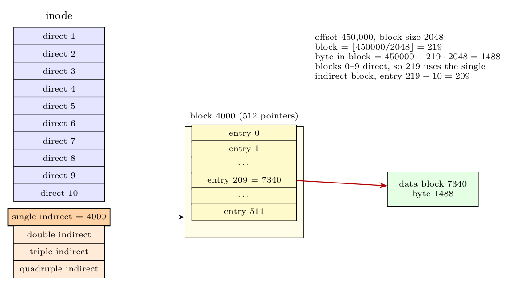

Block size $=2048$ B, 512 pointers per indirect block, 10 direct entries (same structure as in 3(a)).

$$\text{logical block}=\left\lfloor\frac{450{,}000}{2048}\right\rfloor=219,\qquad \text{byte offset in the block}=450{,}000-219\times2048=1488$$

- Logical blocks $0\ldots9$ are direct; blocks $10\ldots10+512-1=521$ are reached through the **single indirect** entry.
- $219\ge10$ and $219\le521$, so the byte is in the single-indirect range at **index $219-10=209$** of the indirect block.

**Steps (assumed block numbers):** the single-indirect entry of the inode contains block number **4000**; the kernel reads block 4000 (the index block); its entry **209** contains block number **7340**; that is the data block; the byte is at **offset 1488** in block 7340.
