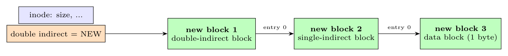

**Yes.** When the first byte is written at an offset that lies in the **double-indirect** range of a file whose inode has no double-indirect block yet, `bmap` has to allocate:

1. a block for the **double-indirect block** itself;
2. a block for a **single-indirect block** (entry 0 of the double-indirect block points to it);
3. the **data block** that will hold the byte (entry 0 of that single-indirect block).

So three disk blocks are allocated (and their numbers recorded in the inode, the double-indirect block and the single-indirect block) to store one byte. Likewise, writing the first byte beyond the double-indirect range needs four new blocks (triple, double, single, data). The same effect occurs when the first byte goes into the single-indirect range: two blocks (the indirect and the data block).
