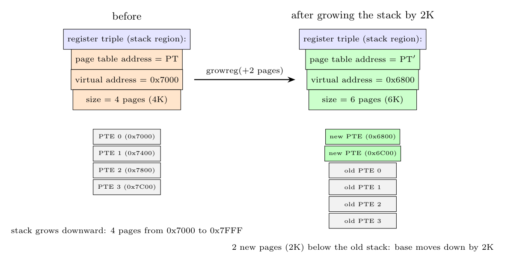

**Register triple.** The memory-management hardware has, for each region of the running process (text, data, stack), a **triple of registers**:

1. the **address of the page table** that maps the region,
2. the **virtual address** at which the region starts (the "base" from which the page table is indexed),
3. the **size** (number of pages) and protection bits of the region.

The hardware uses the triple on every memory reference: it checks that the virtual address lies within the region, indexes the page table to find the frame, and checks the protection. Changing the process's memory therefore means changing its triples (and the kernel reloads them on a context switch).

**Growing the stack region by 2K** (page size 1K, stack grows toward lower addresses). Example: the stack is 4 pages starting at virtual address $0x7000$, so the triple is $(PT,\ 0x7000,\ 4)$.

`growreg` does the following:

1. Allocate **2 new pages** (2K) and extend the page table by two entries (it may allocate a bigger page table and copy the old entries, so the page-table address in the triple may change to $PT'$).
2. Because the stack grows *downwards*, the new pages are placed **below** the old stack, so the **virtual address in the triple decreases by 2K**: $0x7000-0x800=0x6800$.
3. The **size increases by 2 pages**: $4\to6$.

New triple: $(PT',\ 0x6800,\ 6)$; the two new entries are $0x6800$ and $0x6C00$.
