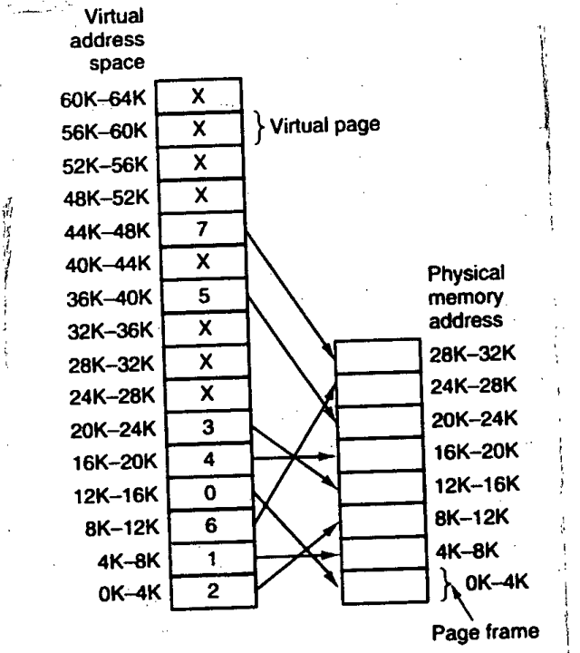

Using the page table below, give the physical address corresponding to each of the following virtual addresses: (i) 20, (ii) 4100, and (iii) 8300

The virtual pages and their page-frame entries, as read from the figure (X = not mapped):

| Virtual page | Frame |
|:--|:-:|
| 0K-4K | 2 |
| 4K-8K | 1 |
| 8K-12K | 6 |
| 12K-16K | 0 |
| 16K-20K | 4 |
| 20K-24K | 3 |
| 24K-28K, 28K-32K, 32K-36K | X |
| 36K-40K | 5 |
| 40K-44K | X |
| 44K-48K | 7 |
| 48K-64K | X |
