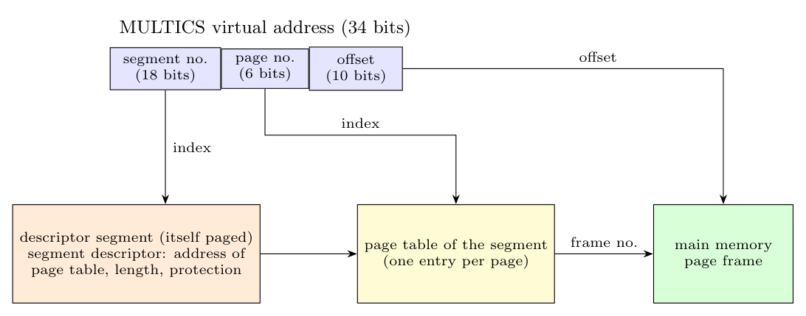

**Advantages of segmentation over paging**

- A segment is a **logical unit** (procedure, array, stack) with its **own address space**; several segments can grow or shrink independently without colliding (no compile-time layout problems like the "fixed table" problems).
- **Sharing** and **protection** are simple and natural: a shared library is one segment; each segment has its own protection (read-only code, read/write data, execute-only), and the programmer knows the unit.
- **Linking** is easier: procedures in separate segments can be recompiled without re-addressing others.
- No *internal* fragmentation (but external fragmentation appears; paging has the opposite property).

**MULTICS: segmentation with paging.** The virtual address has a 34-bit format: **segment number (18 bits)**, **page number (6 bits)**, **offset (10 bits)** within a 1024-word page.

1. The segment number indexes the **descriptor segment** (a segment holding the segment descriptors of the process, which is itself paged); the **segment descriptor** gives the address of the segment's **page table**, the segment length and protection bits.
2. The page number indexes the **page table of that segment**, giving the page frame number.
3. The frame number is combined with the 10-bit offset to form the physical address.

To avoid the two extra memory references, MULTICS uses a small fast associative memory (a TLB of 16 words) holding the most recently used (segment, page) translations.
