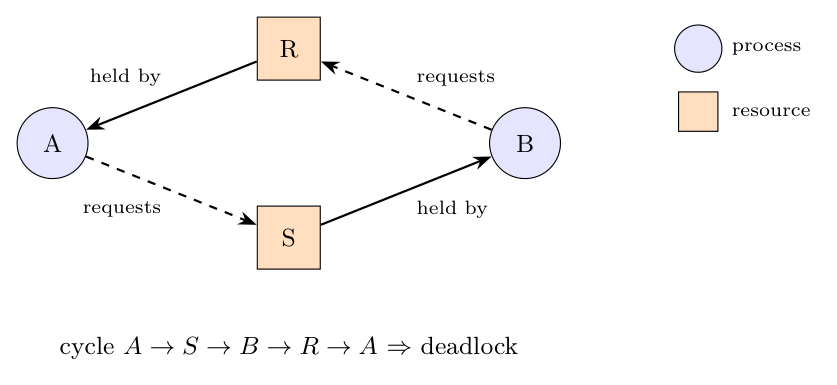

**Resource allocation graph.** A directed graph with two kinds of nodes: **processes** (circles) and **resources** (squares).

- An arc **from a resource to a process** (R $\to$ P): the resource is **allocated** to (held by) that process.
- An arc **from a process to a resource** (P $\to$ R): the process **requests** the resource and is blocked waiting for it.

If the graph contains a **cycle** (and each resource has a single instance), the processes in the cycle are deadlocked.

**Example.** A holds R and requests S; B holds S and requests R:

The cycle $A\to S\to B\to R\to A$ shows the deadlock.

**Algorithm (one resource of each type).** For each node $N$ in the graph, as a starting node, do:

1. Initialise $L$ to the empty list and designate all arcs as unmarked.
2. Add the current node to $L$ and check whether the node now appears **twice** in $L$. If so, **a cycle has been found: deadlock**; terminate.
3. From the current node, check whether there are any unmarked outgoing arcs. If yes, go to step 4; if not, go to step 5.
4. Pick an unmarked outgoing arc at random and **mark** it. Follow it to the new current node and go to step 2.
5. If this node is the initial node, **no cycle** was found from it; terminate (go to the next start node). Otherwise we are at a dead end: **remove** the node from $L$, go back to the previous node, make it the current node and go to step 3.

If no start node yields a cycle, the system is not deadlocked.
