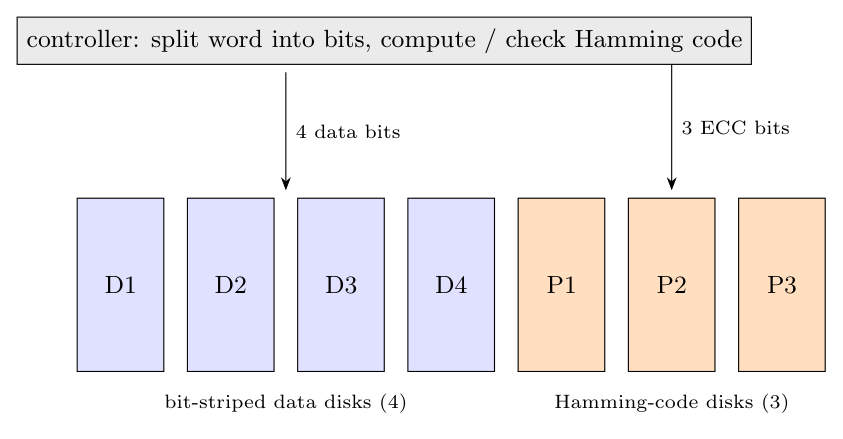

**Architecture.** Data is striped across the disks at the **bit level** (each bit of a word on a different disk) and the disks have their **spindles synchronised**. Extra disks hold a **Hamming error-correcting code** computed over the bits of each word: for 4 data disks, 3 code disks are needed (a 7-bit Hamming codeword).

On a write the controller computes the Hamming bits and writes the data and check bits on all disks at the same time; on a read it reads all the disks, recomputes the code and corrects a single-bit error on the fly.

**Advantages**

- Corrects a **single-bit error** and detects a double error without a separate failure indication from the drive.
- A failed drive's bit is rebuilt immediately from the code (no loss of availability).
- **Very high transfer rate** for large sequential reads and writes (all disks work in parallel).

**Disadvantages**

- **Many extra disks** ($\log N$ code disks), so the capacity overhead is large (3 of 7 disks in the example).
- All drives must be **rotationally synchronised**.
- Poor for **small random requests**: every request involves all the disks, so only one request is served at a time.
- The check bits are redundant because modern disks have their own sector ECC, so RAID 2 is **no longer used** in practice.
