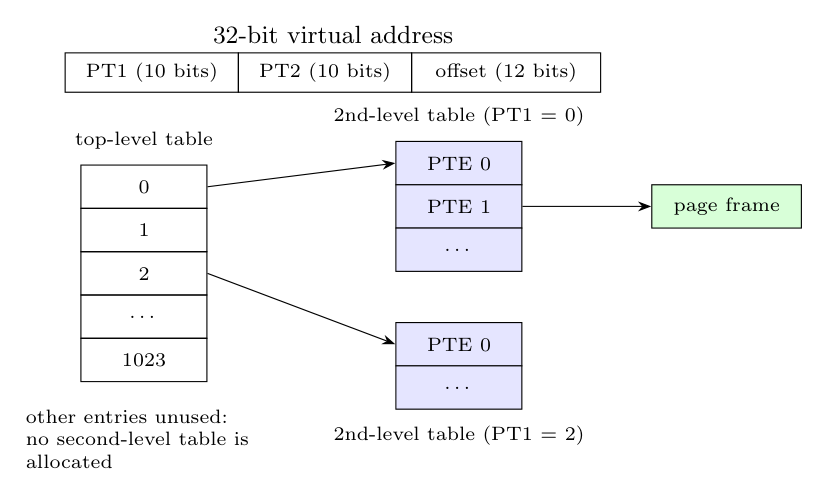

**Problem.** With a single-level table, there must be one entry for every virtual page, even if the page is never used, and the table must be kept (contiguously) in memory for each process. For a 32-bit address space with 4 KB pages and 4-byte entries, the table has $2^{20}$ entries $=4$ MB *per process*; for a 64-bit space it would be astronomically large. Most of it is empty, since a process uses only a small part of its address space.

**Solution: multilevel page tables.** Split the page number into several fields and organise the table as a tree. Example for 32 bits, 4 KB pages: PT1 (10 bits), PT2 (10 bits), offset (12 bits).

The top-level table has $2^{10}=1024$ entries (4 KB); each entry points to a second-level table of 1024 PTEs (4 KB), which is **allocated only if that 4 MB region of the address space is used**. Address translation: use PT1 to index the top-level table, PT2 to index the selected second-level table, then add the offset to the frame.

**Space efficiency (example).** A process with 4 MB text, 4 MB data and 4 MB stack (12 MB in all) needs only 1 top-level table + 3 second-level tables $=4\times4$ KB $=16$ KB, instead of 4 MB for the single-level table. Pages that are not used need no table space at all.

**Cost:** one extra memory access per translation level on a TLB miss, which the TLB hides.
