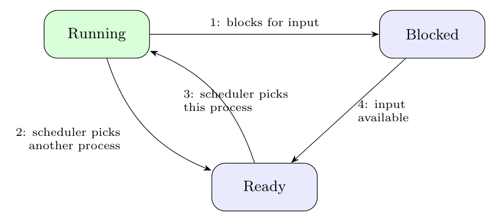

**The three states:** *Running* (using the CPU), *Ready* (runnable, waiting for the CPU) and *Blocked* (unable to run until some external event happens).

**The four transitions**

1. **Running $\to$ Blocked:** the process blocks for input or waits for an event (an I/O request or a `sleep`/`wait`).
2. **Running $\to$ Ready:** the scheduler picks another process, for example when the time slice expires.
3. **Ready $\to$ Running:** the scheduler picks this process to run.
4. **Blocked $\to$ Ready:** the external event happens (input becomes available, I/O completes), so the process is runnable again.
