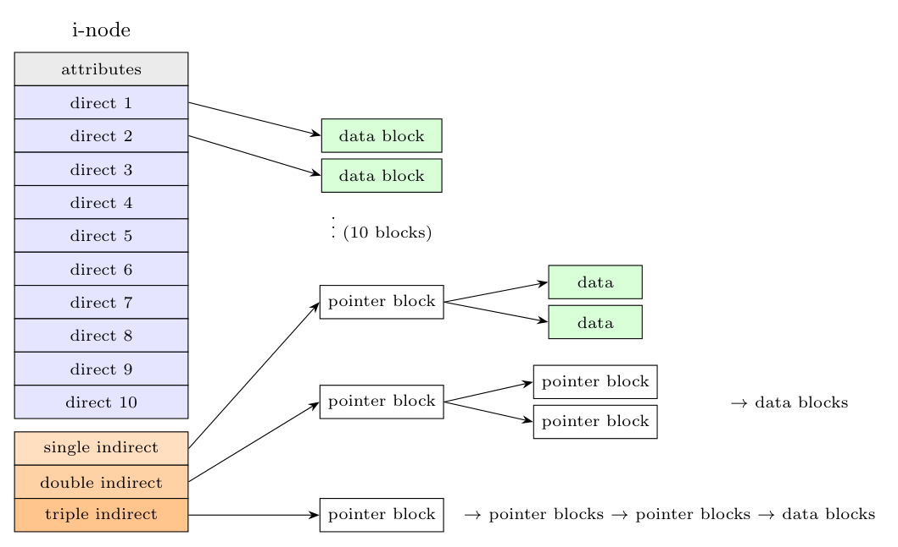

The UNIX V7 file system keeps all the block addresses of a file in its **i-node**, which has **13 disk addresses**: the first **10 are direct**, the other 3 are **single, double and triple indirect**. Small files need no extra block; large files use pointer blocks.

With 1 KB blocks and 4-byte disk addresses, a pointer block holds $1024/4=256$ addresses:

| Pointers | Blocks reached |
|:--|:-:|
| 10 direct | 10 |
| single indirect | $256$ |
| double indirect | $256^2 = 65{,}536$ |
| triple indirect | $256^3 = 16{,}777{,}216$ |
| **Total** | about $16.8\times10^6$ blocks $\approx$ **16 GB** |

To read block number $b$ of a file: if $b<10$ use the direct pointer; else if $b<10+256$ read the single-indirect block and use entry $b-10$; else use the double (and, for still larger $b$, the triple) indirect block, going one level deeper for each extra level. The extra pointer blocks are read only for large files, and frequently used ones stay in the buffer cache.
