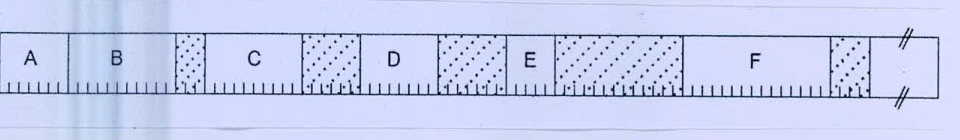

In the snapshot of memory given below, the dotted areas indicate holes and A, B, C, D, E, F are processes currently in memory. Create a linked list of processes and holes for swapping, assuming that there is no virtual memory. (5+5=10)

A new process named G has to be allocated in memory now. The size of G is 4 allocation units. Mention the hole where G will be allocated if we follow:

(i) First-fit

(ii) Best-fit
