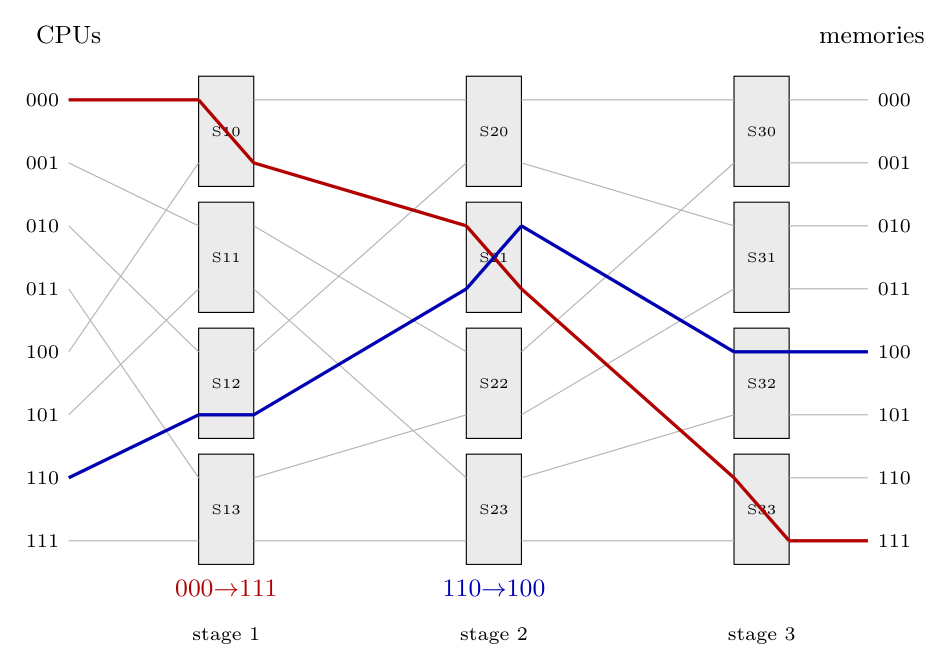

**Omega network for 8 CPUs and 8 memories.** $\log_2 8 = 3$ stages, each with $8/2=4$ two-by-two switches ($12$ switches in all). Between the stages there is a **perfect shuffle** of the 8 lines. A request carries the 3-bit memory address; in stage $i$ the switch looks at bit $i$ (most significant first): **0 $\to$ upper output, 1 $\to$ lower output**.

(Line numbers: CPU/memory lines $000\ldots111$; switch $Sik$ is the $k$-th switch in stage $i$.)

**Routes.**

| Request | Stage 1 | Stage 2 | Stage 3 |
|:--|:--|:--|:--|
| CPU 000 $\to$ Mem 111 | S10, bit 1 $\to$ lower output (line 001) | S21 (input 010), bit 1 $\to$ lower (line 011) | S33 (input 110), bit 1 $\to$ lower (line 111) |
| CPU 110 $\to$ Mem 100 | S12 (line 110 shuffles to 101), bit 1 $\to$ lower (line 101) | S21 (input 011), bit 0 $\to$ upper (line 010) | S32 (input 100), bit 0 $\to$ upper (line 100) |

Output lines used: stage 1: $001$ and $101$; stage 2: $011$ and $010$; stage 3: $111$ and $100$.

**Can they run in parallel?** **Yes.** The two requests never need the same output line of any switch: they meet only at switch S21 in stage 2, but one arrives on its upper input and goes to the lower output, the other arrives on the lower input and goes to the upper output (the switch is simply set to "cross"). So there is no blocking, and both transfers proceed simultaneously.

*(Both routes were also checked with a short script that applies the shuffle-and-set-bit rule at each stage.)*
