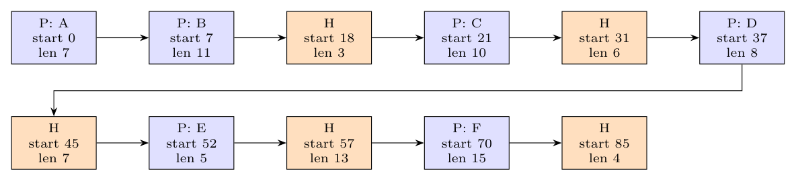

**Reading the snapshot** (each tick mark is one allocation unit; sizes are read from the figure):

| Region | A | B | hole | C | hole | D | hole | E | hole | F | hole |
|:--|:-:|:-:|:-:|:-:|:-:|:-:|:-:|:-:|:-:|:-:|:-:|
| Start | 0 | 7 | 18 | 21 | 31 | 37 | 45 | 52 | 57 | 70 | 85 |
| Length | 7 | 11 | 3 | 10 | 6 | 8 | 7 | 5 | 13 | 15 | 4 |

**Linked list** (each node: P/H, start address, length, next pointer):

**Placing G (4 units).**

(i) **First-fit** scans the list from the beginning and takes the first hole that is large enough. The first hole (3 units) is too small; the second hole (start 31, 6 units, between C and D) fits. **G goes into the 6-unit hole between C and D**; a hole of 2 units remains.

(ii) **Best-fit** examines the whole list and takes the smallest hole that is large enough. Holes: 3, 6, 7, 13, 4 units. The smallest that fits 4 units is the **4-unit hole at the end (after F)**: an exact fit, with no leftover hole.

*Note:* the sizes depend on counting the tick marks in the scan; the answer (6-unit hole for first-fit, 4-unit hole for best-fit) is unchanged as long as the first hole is smaller than 4 and the last hole is exactly 4.
