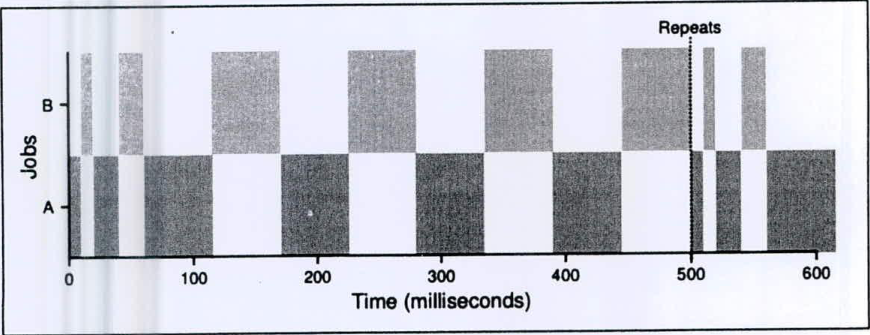
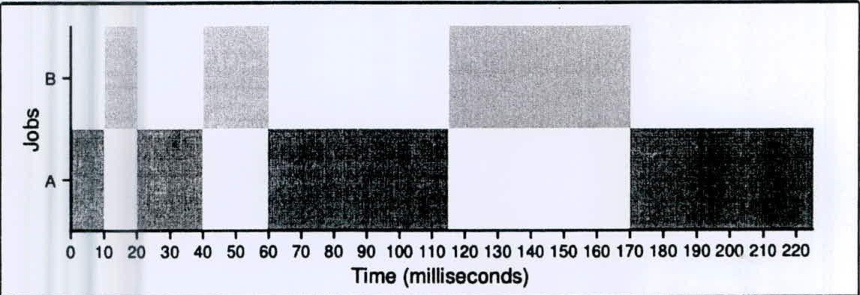

Assume an OS with MLFQ (multi-level feedback queue) scheduler.

Here is a timeline of what happens when two CPU-bound (no I/O) jobs, **A** and **B** run:

This figure shows when A and B run over time. Note that after 500 milliseconds, the behavior repeats, indefinitely (until the jobs are done). To help you further, a closeup of the first part of the graph is shown below:

Now, answer the following questions:

i. How many queues do you think there are in this MLFQ scheduler?

ii. How long is the time slice at the top-most (high priority) queue?

iii. How long is the time slice at the bottom-most (low priority) queue?

iv. How often do processes get moved back to the topmost queue?

v. Why does the scheduling policy MLFQ move processes to higher priority levels (i.e., the topmost queue) sometimes? Briefly explain.
