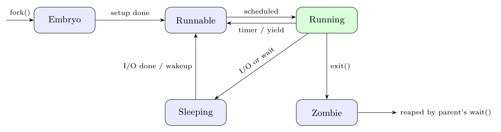

These are the process states used in xv6 (OSTEP, ch. 4 and the xv6 `proc.h`).

| State | Meaning |
|:--|:--|
| **Embryo** | The process has just been created by `fork()`; its PCB, kernel stack and address space are still being set up. |
| **Runnable** | Fully set up and ready to run, waiting in the ready queue for the CPU. |
| **Running** | Currently executing on a CPU. |
| **Sleeping** | Blocked waiting for an event (disk I/O, a lock, a child, a timer); not eligible for the CPU. |
| **Zombie** | Has called `exit()`; resources are released but the PCB (with the exit status) stays until the parent calls `wait()`. |

Transitions:

- Embryo $\to$ Runnable: the kernel finishes setting up the new process.
- Runnable $\to$ Running: the scheduler dispatches it.
- Running $\to$ Runnable: the time slice ends (timer interrupt) or the process yields.
- Running $\to$ Sleeping: it requests I/O or waits for an event.
- Sleeping $\to$ Runnable: the event happens (I/O interrupt / wakeup).
- Running $\to$ Zombie: it calls `exit()`.
- Zombie $\to$ (freed): the parent calls `wait()` and the PCB is reclaimed.
