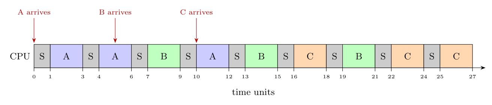

**Assumptions.** The scheduler $S$ (1 unit) runs before every time slice; a job that arrives while another is running is queued in arrival order; a job preempted at the end of its slice goes to the tail of the queue. Each job needs 6 units.

**i. Round-robin graph** (slice = 2 units, $S$ = 1 unit):

Details of the queue: $A$ runs $1\text{-}3$ and $4\text{-}6$ (no other job yet, $B$ arrives at 5); at 6 the queue is $B, A$. $B$ runs $7\text{-}9$; $A$ runs $10\text{-}12$ and **finishes at 12**; $C$ (arrived at 10) is queued behind $B$. $B$ runs $13\text{-}15$, $C$ runs $16\text{-}18$, $B$ runs $19\text{-}21$ and **finishes at 21**, then $C$ runs $22\text{-}24$ and $25\text{-}27$ and **finishes at 27**.

**ii. Response time** (first time the job gets the CPU, minus arrival):

| Job | Arrival | First run | Response |
|:-:|:-:|:-:|:-:|
| A | 0 | 1 | 1 |
| B | 5 | 7 | 2 |
| C | 10 | 16 | 6 |

Average response time $= (1+2+6)/3 = \mathbf{3}$ time units.

**iii. Turnaround time** (completion minus arrival):

| Job | Arrival | Completion | Turnaround |
|:-:|:-:|:-:|:-:|
| A | 0 | 12 | 12 |
| B | 5 | 21 | 16 |
| C | 10 | 27 | 17 |

Average turnaround time $= (12+16+17)/3 = \mathbf{15}$ time units.
