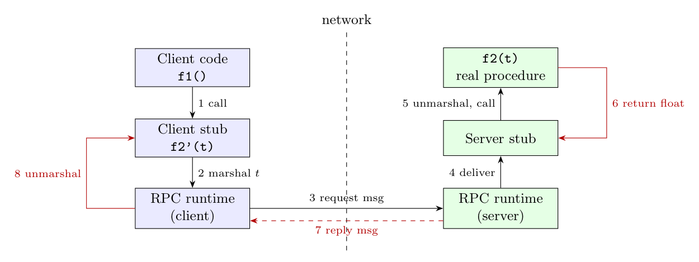

**RPC (remote procedure call)** lets a process call a procedure that executes on another machine *as if it were local*. The call and return are carried by messages, but the programmer only writes an ordinary procedure call; the hard work is hidden in generated **stubs** and the **RPC run-time library**.

For the call `p = f2(*a)` in `f1`, with `f2` running remotely:

1. **Client stub.** `f1` calls a local *client stub* `f2'(t)` that has the same name and signature as `f2`.
2. **Marshalling.** The stub packs the procedure identifier and the argument `t` (an `int`, passed by value) into a message, converting it to a canonical network format (byte order, e.g. big-endian / XDR). Pointers cannot be passed as addresses: here `*a` is dereferenced first, so the value is sent.
3. **Send.** The client run-time looks up the server (binding via a name service or port mapper), sends the request using UDP/TCP and blocks the caller; it starts a timer.
4. **Receive at the server.** The server run-time receives the message and hands it to the *server stub*.
5. **Unmarshal and call.** The server stub unpacks `t`, converts it to the server's representation and calls the real `f2(t)`.
6. **Return.** `f2` returns a `float`; the server stub marshals it into a reply message.
7. **Reply.** The server run-time sends the reply back.
8. **Unmarshal at the client.** The client run-time wakes the client stub, which unmarshals the `float` and returns it to `f1` as the value of `f2(*a)`.

**Details that must be handled:** parameter marshalling and data-representation differences; passing pointers and structures; binding/naming (finding the server); the transport protocol; **failures**: lost request or reply (timeouts, retransmission, duplicate detection), server crash, giving at-most-once or at-least-once semantics (a retry is safe only for idempotent procedures); and security/authentication.
