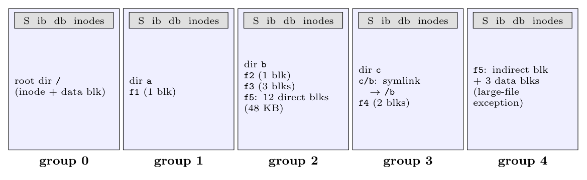

**File system.** 4 KB blocks, 5 block groups (each with a copy of the superblock S, inode and data bitmaps, an inode table and data blocks).

**FFS placement policy.**

- **Directories:** put a new directory in the group with *few directories and many free inodes*, so that directories are spread out.
- **Files:** put a file's inode in the same group as its parent directory, and its data blocks in the same group as its inode (locality for `ls`, `cat`, ...).
- **Large-file exception:** a big file must not fill a group, so after the 12 direct blocks the rest goes to another group.

**Sizes in blocks (4 KB):** `f1` 2 KB $\to$ 1; `f2` 1 KB $\to$ 1; `f3` 10 KB $\to$ 3; `f4` 7 KB $\to$ 2; `f5` 60 KB $\to$ 15 (12 direct + 3 via the indirect block).

**Important:** `/c/b` is a *symbolic link* to the directory `/b`, so `/c/b/f3` is the same as `/b/f3`: `f3` is a file in directory `b`, not in a separate directory `/c/b`. The link `c/b` is only a small inode (plus a name entry in `c`'s directory) in `c`'s group.

- **Group 0:** root directory.
- **Group 1:** directory `a` and `f1`.
- **Group 2:** directory `b`, `f2`, `f3`, and the first 12 blocks of `f5`.
- **Group 3:** directory `c`, the symlink `c/b` (storing the path `/b`) and `f4`.
- **Group 4:** the indirect block and the last 3 data blocks of `f5` (large-file exception).

*Assumption:* the directories `a, b, c` are created in that order and land in the next emptiest groups; the paper does not fix this.
