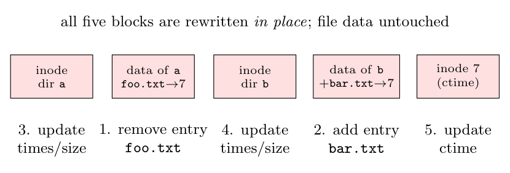
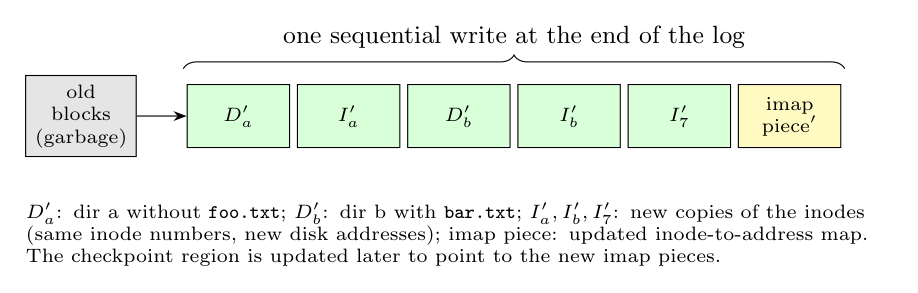

`mv ~/a/foo.txt ~/b/bar.txt` is a **rename** within one file system: the file's *data is never copied*; only directory entries change. The file keeps its inode number (say 7).

**i. VSFS (update in place).** After the path lookup (reading the inodes and data blocks of `/`, `~`, `a`, `b`), the blocks below are changed in place:

1. Remove the entry `foo.txt` from the data block of directory `a`.
2. Add the entry `bar.txt` $\to$ 7 to the data block of directory `b`.
3. Write `a`'s inode (modification time).
4. Write `b`'s inode (modification time, size).
5. Write inode 7 (change time).

The operation touches several blocks that must all be written; a crash in between leaves the file in both directories or in neither, so a journal (or `fsck`) is needed.

**ii. LFS (log-structured).** LFS never overwrites: the **new versions** of all changed blocks are buffered in the in-memory segment and written at the end of the log in a single sequential write:

- new data block of `a` ($D_a'$), new inode of `a` ($I_a'$);
- new data block of `b` ($D_b'$), new inode of `b` ($I_b'$);
- new inode 7 ($I_7'$) with the updated ctime;
- the **inode map** piece(s) pointing to the new inode addresses. (Thanks to the inode map, directories need not be changed just because an inode moved; this avoids the recursive-update problem.)

The old copies become garbage, reclaimed later by the cleaner. The checkpoint region is updated periodically to point to the latest imap pieces. One sequential write replaces many scattered ones; consistency after a crash comes from the checkpoint plus roll-forward.
