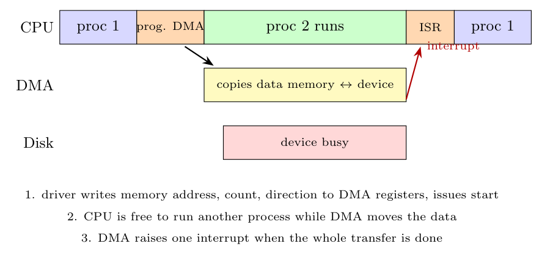

**Idea.** With *programmed I/O* the CPU copies every word to the device. With **DMA (direct memory access)** a special engine copies the data between memory and the device, so the CPU only starts and finishes the transfer.



**OS driver pseudocode** (write of `n` bytes from `buf`):

```c
void dma_write(char *buf, int n) {
    while (STATUS == BUSY) ;               // wait until the DMA/device is idle
    DMA_ADDR  = physical_address(buf);     // where the data is in memory
    DMA_COUNT = n;                         // how many bytes
    DMA_DIR   = TO_DEVICE;                 // direction
    COMMAND   = START;                     // start the transfer
    sleep_on(&dma_done);                   // block this process; the scheduler runs another
}

void dma_interrupt_handler(void) {         // raised by the DMA controller
    acknowledge_interrupt();
    wakeup(&dma_done);                     // the requesting process becomes ready
}
```

**Steps.**

1. The OS tells the DMA controller where the data lives in memory, how much to copy and to which device (writes the DMA registers).
2. The OS blocks the requesting process and runs another one, so the CPU does useful work.
3. The DMA controller transfers the data over the bus, without the CPU.
4. When all the data is moved, the DMA controller raises **one interrupt**; the handler wakes the process.
