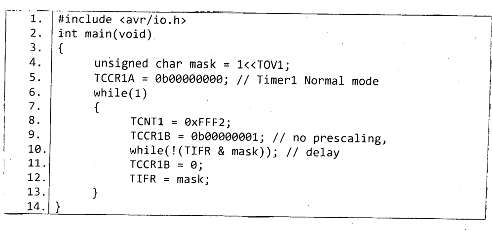

Consider the following C program for Atmega32 microcontroller:

```c
#include <avr/io.h>
int main(void)
{
    unsigned char mask = 1<<TOV1;
    TCCR1A = 0b00000000; // Timer1 Normal mode
    while(1)
    {
        TCNT1 = 0xFFF2;
        TCCR1B = 0b00000001; // no prescaling
        while(!(TIFR & mask)); // delay
        TCCR1B = 0;
        TIFR = mask;
    }
}
```

*Lines are numbered 1-14 in the paper: line 10 is `while(!(TIFR & mask));`, line 11 is `TCCR1B = 0;`, line 12 is `TIFR = mask;`.*



Answer the following questions considering this program:

(i) Calculate the amount time delay (in µsec.) caused by line 10. You have to justify your calculation. Assume that system clock frequency is 8 MHz. Do not consider the clock cycles needed to execute machine instructions.

(ii) What is the effect of line 11 on Timer1?

(iii) What is the effect of line 12 on Timer1?
