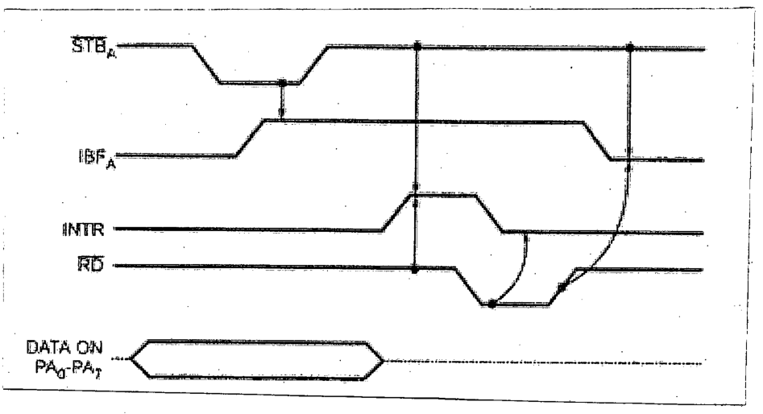

Suppose, 8086 is reading data bytes from a tape reader through Port A of the 8255 using strobed input mode. The timing diagram for one byte of data transfer is given below:

Now consider the following list of events:

| Event ID | Event description |
|:-:|:--|
| 1. | Data byte from tape recorder is no more valid. |
| 2. | 8255 forbids tape recorder to send the next data byte. |
| 3. | 8255 signals tape recorder that it is now safe to send the next data byte. |
| 4. | 8255 loads the data byte into the input latch of Port A. |
| 5. | 8255 informs 8086 about the reception of data using interrupt. |
| 6. | 8086 starts reading the data |

Redraw the timing diagram and mark the first occurrence of each event with the corresponding event ID surrounded by a circle on the timing diagram.
