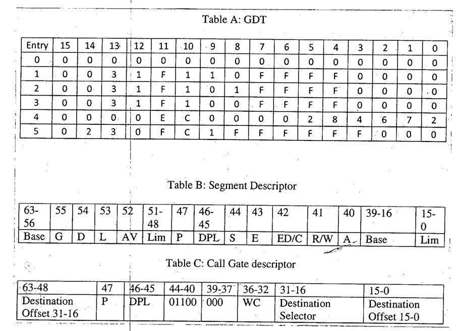

**Table A: GDT** (hex digits 15 down to 0 of each 64-bit entry)

| Entry | 15 | 14 | 13 | 12 | 11 | 10 | 9 | 8 | 7 | 6 | 5 | 4 | 3 | 2 | 1 | 0 |
|:-:|:-:|:-:|:-:|:-:|:-:|:-:|:-:|:-:|:-:|:-:|:-:|:-:|:-:|:-:|:-:|:-:|
| 0 | 0 | 0 | 0 | 0 | 0 | 0 | 0 | 0 | 0 | 0 | 0 | 0 | 0 | 0 | 0 | 0 |
| 1 | 0 | 0 | 3 | 1 | F | 1 | 1 | 0 | F | F | F | F | 0 | 0 | 0 | 0 |
| 2 | 0 | 0 | 3 | 1 | F | 1 | 0 | 1 | F | F | F | F | 0 | 0 | 0 | 0 |
| 3 | 0 | 0 | 3 | 1 | F | 1 | 0 | 0 | F | F | F | F | 0 | 0 | 0 | 0 |
| 4 | 0 | 0 | 0 | 0 | E | C | 0 | 0 | 0 | 0 | 2 | 8 | 4 | 6 | 7 | 2 |
| 5 | 0 | 2 | 3 | 0 | F | C | 1 | F | F | F | F | F | F | 0 | 0 | 0 |

**Table B: Segment Descriptor**

| 63-56 | 55 | 54 | 53 | 52 | 51-48 | 47 | 46-45 | 44 | 43 | 42 | 41 | 40 | 39-16 | 15-0 |
|:-:|:-:|:-:|:-:|:-:|:-:|:-:|:-:|:-:|:-:|:-:|:-:|:-:|:-:|:-:|
| Base | G | D | L | AV | Lim | P | DPL | S | E | ED/C | R/W | A | Base | Lim |

**Table C: Call Gate descriptor**

| 63-48 | 47 | 46-45 | 44-40 | 39-37 | 36-32 | 31-16 | 15-0 |
|:-:|:-:|:-:|:-:|:-:|:-:|:-:|:-:|
| Destination Offset 31-16 | P | DPL | 01100 | 000 | WC | Destination Selector | Destination Offset 15-0 |

