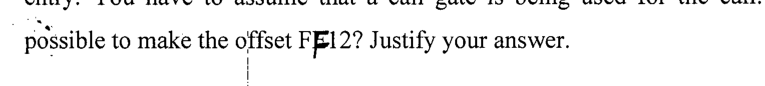

Modify the appropriate entry of the GDT so that the next instruction to be executed is at offset 1234. You can change only one entry in the GDT (Table A); you cannot add any new entry. You need to explain your modification and write down the modified entry. You have to assume that a call gate is being used for the call. Would it be possible to make the offset FF12? Justify your answer.

