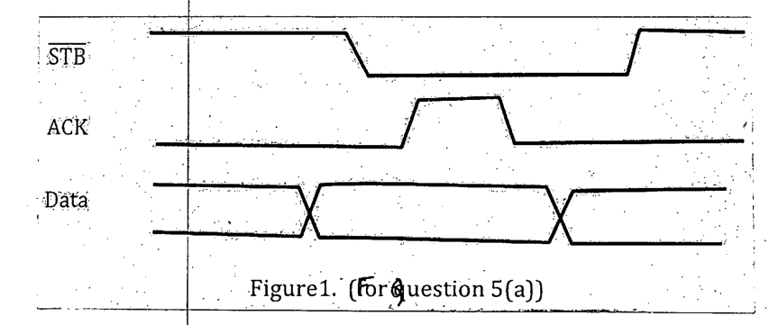

Suppose, Machine A is trying to send data to Machine B in double handshake mode. However, they are facing a problem. The timing diagram they are following is shown below. (7+8=15)

(i) What are the problems of their timing diagram?

(ii) Correct the timing diagram. In your corrected timing diagram mark each transition of every signal with a number surrounded by a circle. For each transition you will have to write down in a separate table who initiates the transition (Machine A or B) and what the transitions signifies.
