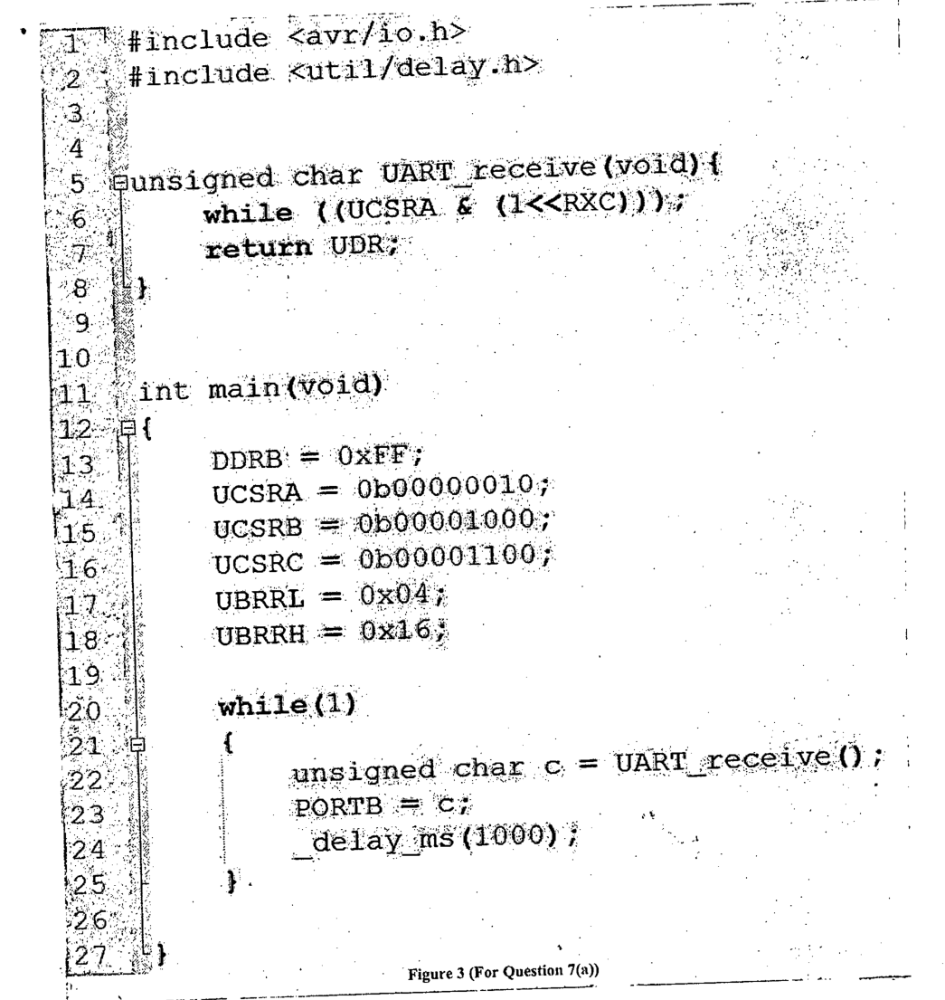

Consider a buggy C code "Buggy.c" in Fig.3, which attempts to receive a byte every second using UART with the following connection parameters: 1200 bps baud rate, even parity, 1 stop bit, normal speed mode, and 8 data bits. Rewrite the code correcting all the mistakes. Clearly mark the portion of your code added or, modified and specify what was the mistake before.

Assume the clock speed of the ATmega32 MCU is set at 8MHz.

The code for parity is as follows: 00, 10, and 11 is for no parity, even parity, and odd parity, respectively.

The code for stop bit is as follows: 0 for 1 and 1 for 2 stop bits.

The code for 8 data bits is 011.

Ignore the time needed for polling and also the status of error bits.

**Figure 3 (For Question 7(a))**

```c
#include <avr/io.h>
#include <util/delay.h>


unsigned char UART_receive(void){
    while ((UCSRA & (1<<RXC)));
    return UDR;
}


int main(void)
{
    DDRB = 0xFF;
    UCSRA = 0b00000010;
    UCSRB = 0b00001000;
    UCSRC = 0b00001100;
    UBRRL = 0x04;
    UBRRH = 0x16;

    while(1)
    {
        unsigned char c = UART_receive();
        PORTB = c;
        _delay_ms(1000);
    }
}
```



**Registers (from Table 1)**

| Register | Bit 7 | 6 | 5 | 4 | 3 | 2 | 1 | 0 |
|:--|:-:|:-:|:-:|:-:|:-:|:-:|:-:|:-:|
| UCSRA | RXC | TXC | UDRE | FE | DOR | PE | U2X | MPCM |
| UCSRB | RXCIE | TXCIE | UDRIE | RXEN | TXEN | UCSZ2 | RXB8 | TXB8 |
| UCSRC | URSEL | UMSEL | UPM1 | UPM0 | USBS | UCSZ1 | UCSZ0 | UCPOL |
