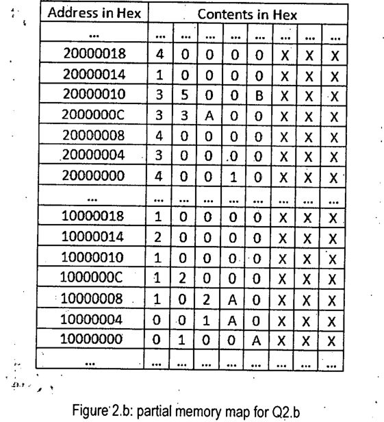

Consider the following linear address: "01405000". Assume that PDBR contains 10000000h. Now for the partial memory map in Figure 2.b, find out the translated physical address. You have to show your calculations for the translation. Also, comment on the content of the page this address belongs to.

**Figure 2.b: partial memory map for Q2.b**

| Address in Hex | Contents in Hex |
|:-:|:-:|
| ... | ... |
| 20000018 | 4 0 0 0 0 X X X |
| 20000014 | 1 0 0 0 0 X X X |
| 20000010 | 3 5 0 0 B X X X |
| 2000000C | 3 3 A 0 0 X X X |
| 20000008 | 4 0 0 0 0 X X X |
| 20000004 | 3 0 0 0 0 X X X |
| 20000000 | 4 0 0 1 0 X X X |
| ... | ... |
| 10000018 | 1 0 0 0 0 X X X |
| 10000014 | 2 0 0 0 0 X X X |
| 10000010 | 1 0 0 0 0 X X X |
| 1000000C | 1 2 0 0 0 X X X |
| 10000008 | 1 0 2 A 0 X X X |
| 10000004 | 0 0 1 A 0 X X X |
| 10000000 | 0 1 0 0 A X X X |
| ... | ... |

*Each row is one 32-bit entry written as 8 hex digits (most significant first); X = don't care.*

