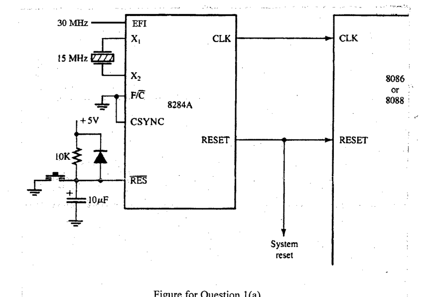

A system comprising a microprocessor 8086 or 8088, a peripheral device, and a clock generator needs to be designed in such a way that the clock generator feeds both the microprocessor and the peripheral device with 5 MHz clock signals. To ensure it, a hardware designer presents the following design where he applies 15 MHz crystal in between X1 and X2, and another 30 MHz signal to EFI to feed necessary clock signals to both the microprocessor and the peripheral device (not shown in the figure).

Now, you need to answer the following (with other necessary diagrams)-

(i) Does the microprocessor get the intended clock signal? If so, then you need to explain how it is getting the clock signal from corresponding input to the clock generator to the clock input of the microprocessor. If not, then you need to explain why the two clock inputs to the clock generator are not enough or appropriate in supplying the intended clock signal to the microprocessor.

(ii) Does the peripheral device get the intended clock signal? If so, then you need to explain how it is getting the clock signal from corresponding input to the clock generator to the clock input of the peripheral device. If not, then you need to explain why the two clock inputs to the clock generator are not enough or appropriate in supplying the intended clock signal to the peripheral device.

