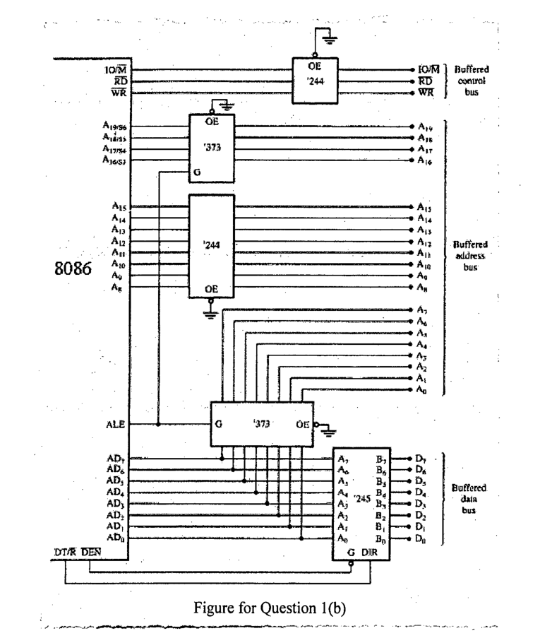

The following circuit is intended for a buffered system of 8086, where all address, control, and data buses are fully buffered. Do you think that the circuit is enough or appropriate for the purpose of fully buffered system of 8086? If so, then explain how it serves the purpose. If not, then present necessary correction(s) or enhancement(s) needed to be made in the circuit.

