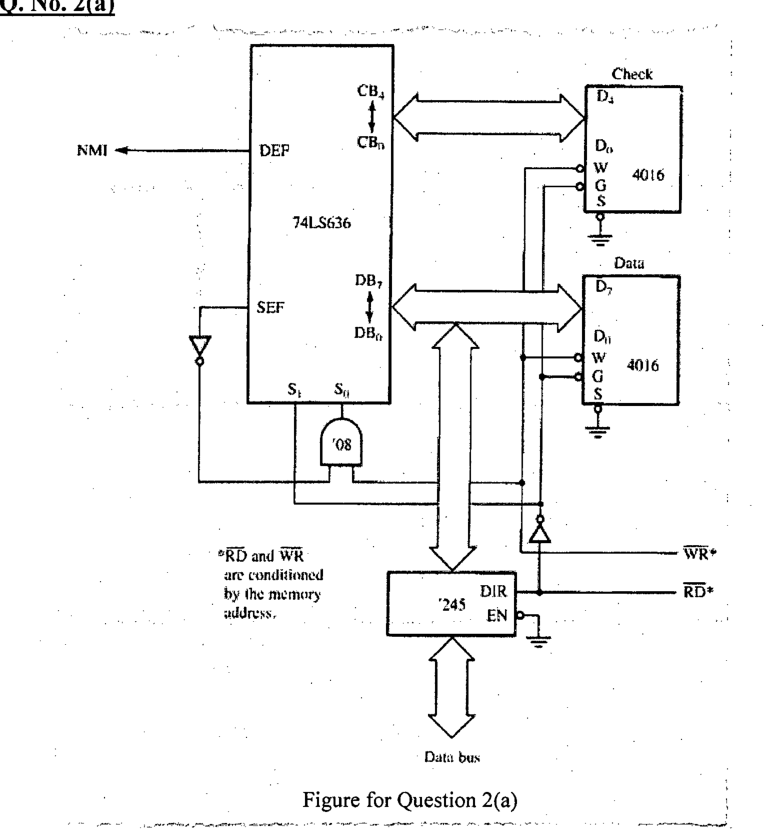

"The following circuit interrupts the microcontroller with NMI in case there happens any single-bit, 2-bit or multi-bit error" – validate or invalidate the statement with necessary elaboration and/or figure(s).

