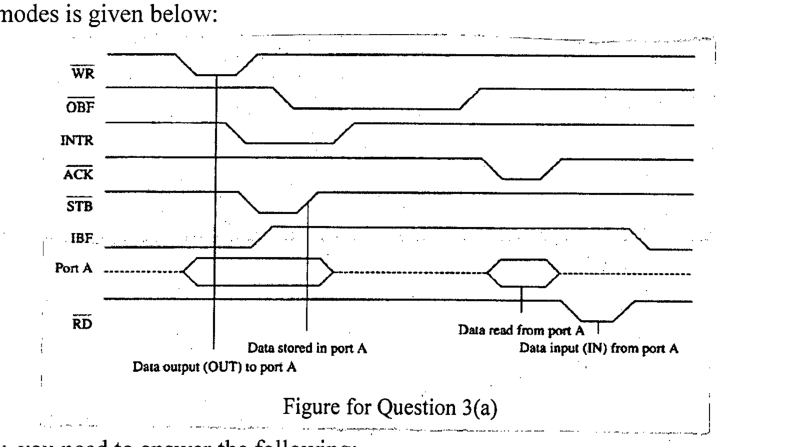

82C55 can operate in three different modes of operations. Timing diagram of one of the modes is given below: (5+15=20)

Now, you need to answer the following:

(i) Which mode of operation is related to the above timing diagram? What can be its possible application?

(ii) What are the input and output signals (to 82C55) in the figure? How do the input signals control the output signal? You need to show it through pointing an arrow from a change in input signal to corresponding change in output signal for all cases.
