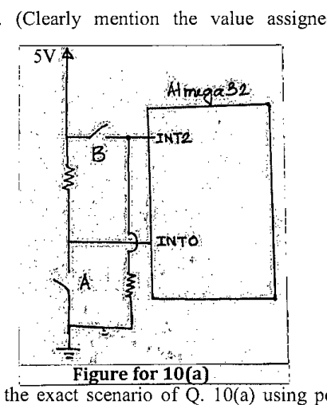

Consider the circuit diagram in Figure 10(a). You have to increment an 8 bit counter when switch A is pressed using interrupt. You also have to decrement the counter when switch B is pressed using interrupt Each interrupt must trigger only a single time as soon as the corresponding switch is pressed. Write two Interrupt Service Routines and the main function in C. (Clearly mention the value assigned to related registers in hexadecimal)

**Registers (from the attached table)**

| Register | Bit 7 | 6 | 5 | 4 | 3 | 2 | 1 | 0 |
|:--|:-:|:-:|:-:|:-:|:-:|:-:|:-:|:-:|
| GICR | INT1 | INT0 | INT2 | - | - | - | IVSEL | IVCE |
| MCUCR | - | - | - | - | ISC11 | ISC10 | ISC01 | ISC00 |
| MCUCSR | JTD | ISC2 | - | - | - | - | - | - |

*Trigger codes: 00 = low level, 01 = any logical change, 10 = falling edge, 11 = rising edge. ISC2: 0 = falling edge trigger, 1 = rising edge trigger.*

Attached sheet: [Figures and Charts for Section B (pinout and registers)](figures/sheet-1.png).
