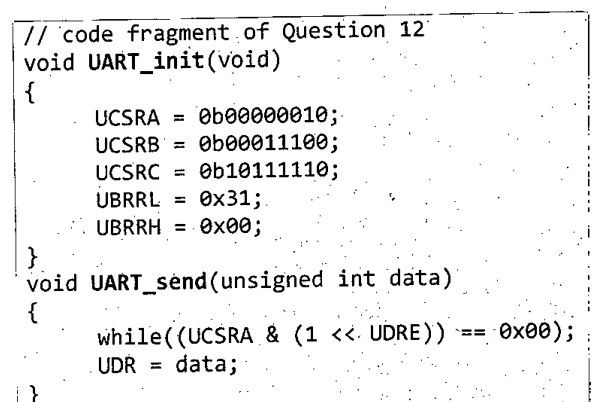

Suppose, Harold wanted to send/receive data using UART with his Atmega32. System clock frequency is $10^{6}$ Hz. In his C code he wrote the following functions to initialize UART and send character data.

```c
// code fragment of Question 12
void UART_init(void)
{
    UCSRA = 0b00000010;
    UCSRB = 0b00011100;
    UCSRC = 0b10111110;
    UBRRL = 0x31;
    UBRRH = 0x00;
}
void UART_send(unsigned int data)
{
    while((UCSRA & (1 << UDRE)) == 0x00);
    UDR = data;
}
```



He saw that data were not transmitting correctly. He then found an error in his UART_send function and corrected in later.

Answer the following three questions based on this scenario.

**Registers (from the attached table)**

| Register | Bit 7 | 6 | 5 | 4 | 3 | 2 | 1 | 0 |
|:--|:-:|:-:|:-:|:-:|:-:|:-:|:-:|:-:|
| UCSRA | RXC | TXC | UDRE | FE | DOR | PE | U2X | MPCM |
| UCSRB | RXCIE | TXCIE | UDRIE | RXEN | TXEN | UCSZ2 | RXB8 | TXB8 |
| UCSRC | URSEL | UMSEL | UPM1 | UPM0 | USBS | UCSZ1 | UCSZ0 | UCPOL |

*UCSZ2, UCSZ1, UCSZ0: 000 = 5-bit, 001 = 6-bit, 010 = 7-bit, 011 = 8-bit, 111 = 9-bit. UPM1, UPM0: 00 = No parity, 10 = even parity, 11 = odd parity. USBS: 0 = 1 stop bit, 1 = 2 stop bits.*
