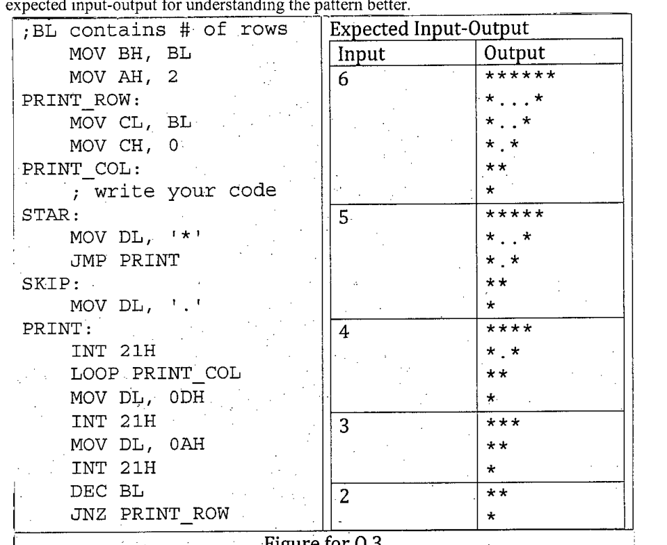

Suppose you want to print a triangular pattern with the following 8086 assembly code. Complete the code snippet by writing the necessary instructions after the PRINT_COL label (writing only these instructions in your answer script will be sufficient). Note that you cannot make any modification anywhere else in the given code. Check out the expected input-output for understanding the pattern better.

**Figure for Q.3**

```text
;BL contains # of rows
    MOV BH, BL
    MOV AH, 2
PRINT_ROW:
    MOV CL, BL
    MOV CH, 0
PRINT_COL:
    ; write your code
STAR:
    MOV DL, '*'
    JMP PRINT
SKIP:
    MOV DL, '.'
PRINT:
    INT 21H
    LOOP PRINT_COL
    MOV DL, 0DH
    INT 21H
    MOV DL, 0AH
    INT 21H
    DEC BL
    JNZ PRINT_ROW
```

**Expected Input-Output**

**Input 6**

```text
******
*...*
*..*
*.*
**
*
```

**Input 5**

```text
*****
*..*
*.*
**
*
```

**Input 4**

```text
****
*.*
**
*
```

**Input 3**

```text
***
**
*
```

**Input 2**

```text
**
*
```


