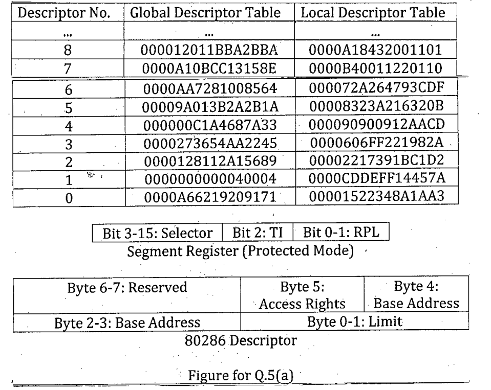

**Figure for Q.5(a)**

| Descriptor No. | Global Descriptor Table | Local Descriptor Table |
|:-:|:-:|:-:|
| ... | ... | ... |
| 8 | 000012011BBA2BBA | 0000A18432001101 |
| 7 | 0000A10BCC13158E | 0000B40011220110 |
| 6 | 0000AA7281008564 | 000072A264793CDF |
| 5 | 00009A013B2A2B1A | 00008323A216320B |
| 4 | 000000C1A4687A33 | 000090900912AACD |
| 3 | 0000273654AA2245 | 0000606FF221982A |
| 2 | 0000128112A15689 | 00002217391BC1D2 |
| 1 | 0000000000040004 | 0000CDDEFF14457A |
| 0 | 0000A66219209171 | 00001522348A1AA3 |

**Segment Register (Protected Mode):** Bit 3-15: Selector | Bit 2: TI | Bit 0-1: RPL

**80286 Descriptor:** Byte 6-7: Reserved | Byte 5: Access Rights | Byte 4: Base Address | Byte 2-3: Base Address | Byte 0-1: Limit

