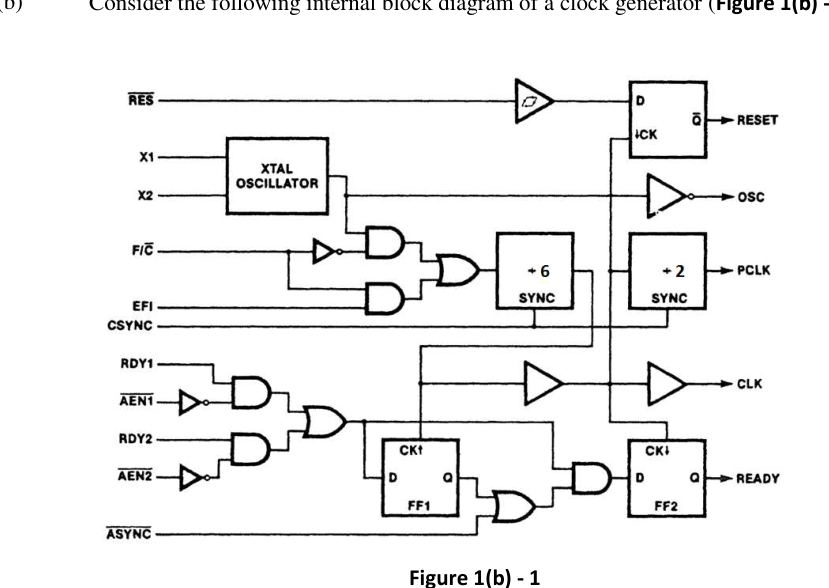
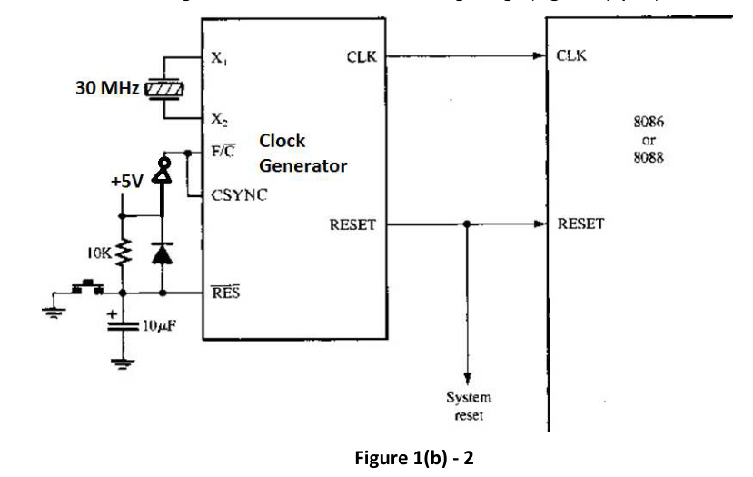

Consider the following internal block diagram of a clock generator (Figure 1(b) - 1).

The above clock generator is used in the following design (Figure 1(b) - 2).

Now, you need to pinpoint in case you find any flaw in the above design. If so, then you need to elaborate and justify how that flaw(s) can be fixed. In case you think that the above design is flawless, you need to explicitly mention that. Unless you mention anything, your answer will be treated as a blank answer.

You need to justify your answer.
