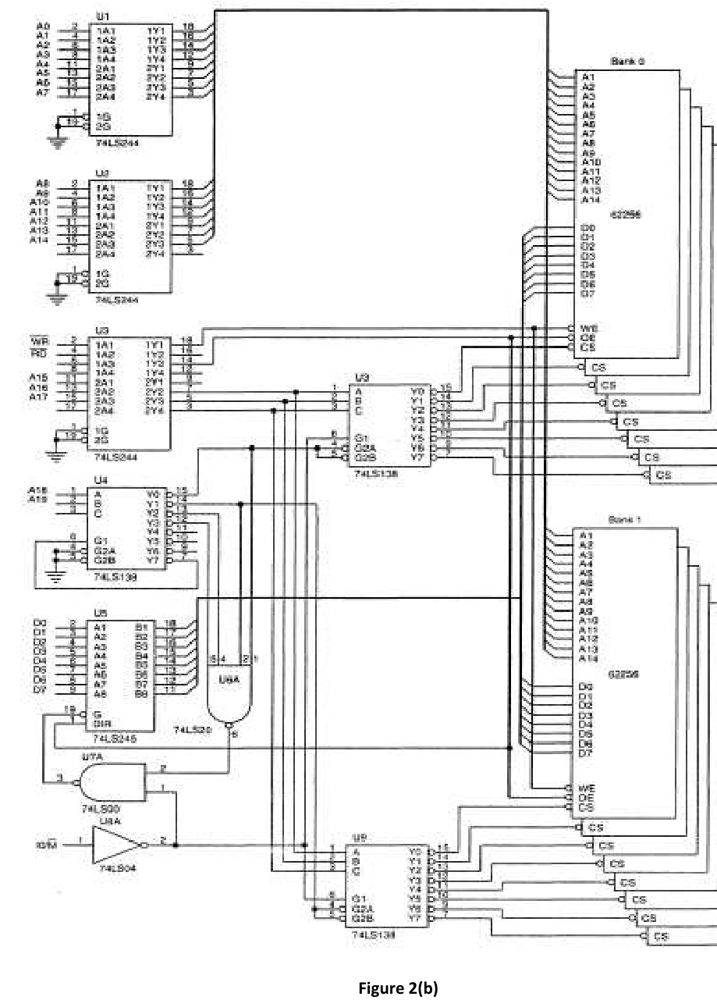

The following figure (Figure 2(b)) shows a working circuit that incorporates sixteen 62256, 32K $\times$ 8 static RAMs interfaced to the 8088, beginning at memory location 00000H. This circuit board uses two decoders to select the memory components and a third to select the other decoders for the appropriate memory sections. Sixteen 32K RAMs fill memory from location 00000H through location 7FFFFH, for 512K bytes of memory.

Now, keeping the memory specifications and address spacing same, you need to use a new microprocessor 80XX instead of 8088. In the new 80XX microprocessor, there is a 16-bit data bus having all other features exactly same as 8088.

You need to show the required change(s) in the above circuit as needed to use 80XX in place of 8088. You need to justify your answer.
