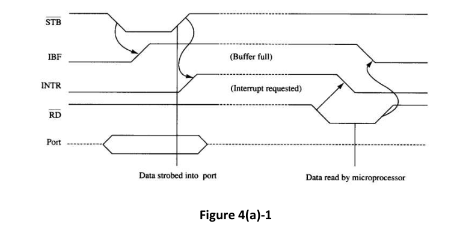
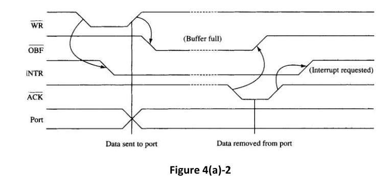
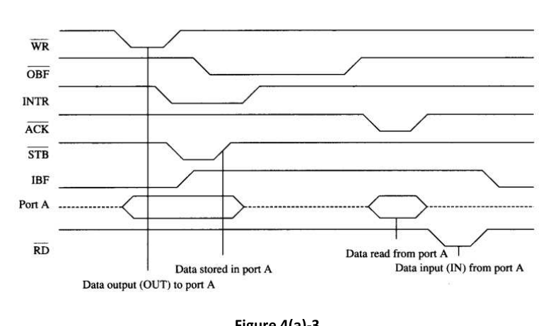

Programmable Peripheral Interface 82C55 has its timing diagram for Mode 1 (Strobed Input) as follows (Figure 4(a)-1).

Its timing diagram for Mode 1 (Strobed Output) is as follows (Figure 4(a)-2).

Now, a hardware engineer gives you the following as the timing diagram of 82C55 for Mode 2 (Figure 4(a)-3).

You need to pinpoint in case you find any flaw in the above timing diagram for Mode 2, specially for the change in the *INTR* signal in response to the initial down edge of the $\overline{RD}$ signal.

If you find any flaw(s), then you need to elaborate and justify how that flaw(s) can be fixed. In case you think that the above design is flawless, you need to explicitly mention that. Unless you mention anything, your answer will be treated as a blank answer.

You need to justify your answer.
