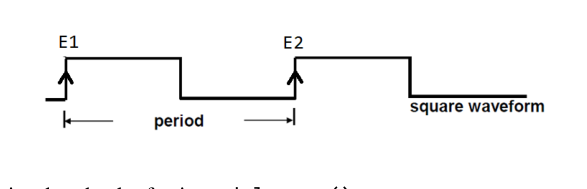

Suppose you are measuring period of a square wave using TIMER1 of Atmega32. Square wave is fed to ICP1. At the point of rising edge E1, the value of TCNT1 is 6700. At the rising edge E2, the value of TCNT1 is 8000. From T1 to T2, TIMER1 overflow occurred 2 times. Prescaler is 0 i.e. TIMER1 clock is running as fast as internal 1MHz clock. What is the period of the square wave?

