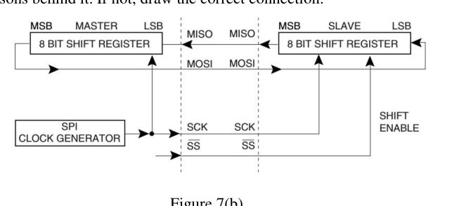

Suppose, for a SPI communication, the data order bit is set to 1 meaning LSB of the data word will be transmitted first. In this regard, Figure 7(b) shows a master slave connection. Is the connection shown in Figure 7(b) compatible with the mentioned data order? If yes, show the reasons behind it. If not, draw the correct connection.

