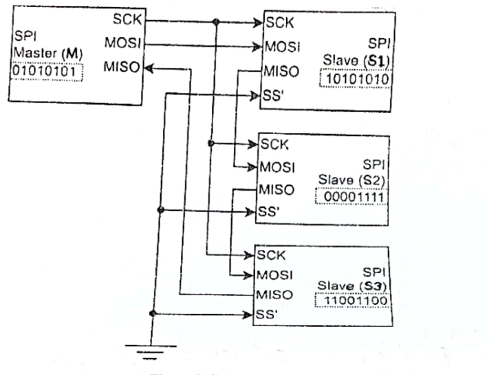

Three SPI Slave (S1, S2 and S3) is connected to a SPI Master (M) as shown in Figure 2(d). Initially, each device has eight bits of data in its shift registers as shown in corresponding dotted box. Each device is also configured to transmit the MSB first. Determine the contents of the shift registers of four devices after

(i) 4 clock pulses

(ii) 16 clock pulses

*Figure 2(d), as read from the scan: Master M holds 01010101; S1 holds 10101010, S2 holds 00001111, S3 holds 11001100. M's SCK goes to all three slaves and all SS' inputs are grounded. The data lines form a daisy chain: M MOSI to S1 MOSI, S1 MISO to S2 MOSI, S2 MISO to S3 MOSI, S3 MISO back to M MISO. Check the wiring against the figure.*
