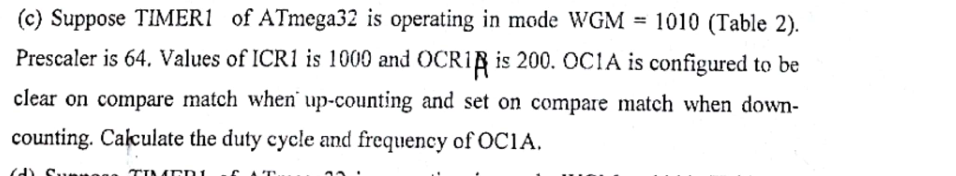

Suppose TIMER1 of ATmega32 is operating in mode WGM = 1010 (Table 2). Prescaler is 64. Values of ICR1 is 1000 and OCR1B is 200. OC1A is configured to be clear on compare match when up-counting and set on compare match when down-counting. Calculate the duty cycle and frequency of OC1A.

*The attached register list and Table 2 are not in the scan; if a configuration is missing, the paper says to assume one.*
