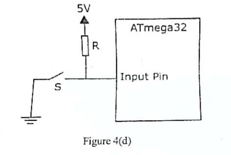

A switch S is connected to ATmega32 as shown in Figure 4(d). To perform as expected, you need to choose the resistence of R carefully. Explain the issues if the resistence of R is chosen to be too high or too low.

