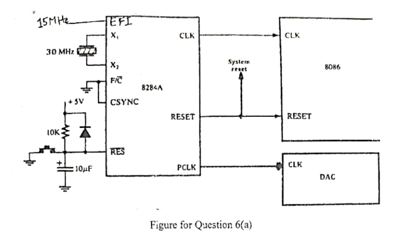

John is designing a system with an 81212 microprocessor, a DAC, and a clock generator (8284A). For his system he needs to feed the microprocessor with 10 MHz clock signal and the DAC with 15 MHz clock signal. To ensure it, John applies 30 MHz crystal in between X1 and X2, and another 15 MHz signal to EFI of the 8284A. He feeds the microprocessor with CLK signal and the DAC with PCLK signal from the clock generator as shown in figure 6(a).

Now, you need to answer the following (with other necessary diagrams)-

i. Does the microprocessor get the intended clock signal? If so, then you need to explain how it is getting the clock signal at the clock input of the microprocessor from corresponding input to the clock generator. If not, then you need to explain why the two clock inputs to the clock generator are not enough or appropriate in supplying the intended clock signal to the microprocessor.

ii. Does the DAC get the intended clock signal? If so, then you need to explain how it is getting the clock signal from corresponding input to the clock generator to the clock input of the DAC. If not, then you need to explain why the two clock inputs to the clock generator are not enough or appropriate in supplying the intended clock signal to the a DAC.

