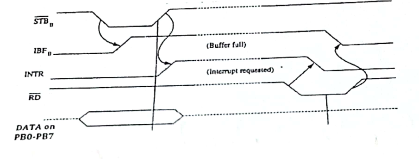

Suppose 8086 is reading data bytes from a typewriter through PORT B of the 8255 using strobed input mode (mode 1). The timing diagram for one byte of data transfer is given below:

Now redraw the same timing diagram in your answer script and mark the first occurrence of each of the following events with the corresponding even ID surrounded by a circle on the timing diagram.

| Event ID | Event Description |
|:-:|:--|
| 1 | 8255 loads Data into its input latch |
| 2 | The typewriter indicates that data is no more valid |
| 3 | The typewriter sends data to port's data line |
| 4 | 8255 forbids the typewriter to send next data |
| 5 | 8255 prevents a second interrupt for the same data |
| 6 | CPU starts reading the data |
| 7 | Data Transfer complete |
| 8 | 8255 informs CPU about the data by generating interrupt signal |
| 9 | Read complete |
