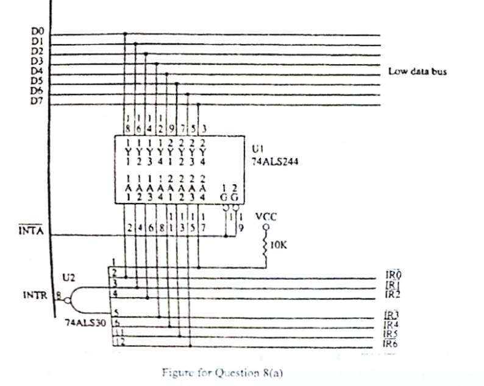
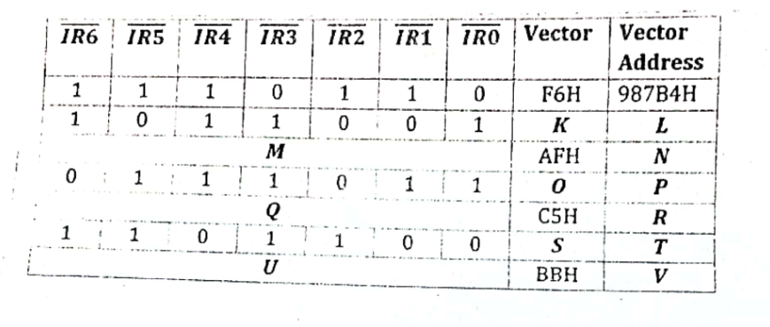

Ralph is using the circuit in Figure 8(a) for interrupt expansion for his term project.

The interrupt vectors and their corresponding vector addresses for single trigger of any one interrupt are shown in the following table:

| $\overline{IR6}$ | $\overline{IR5}$ | $\overline{IR4}$ | $\overline{IR3}$ | $\overline{IR2}$ | $\overline{IR1}$ | $\overline{IR0}$ | Vector | Vector Address |
|:-:|:-:|:-:|:-:|:-:|:-:|:-:|:-:|:-:|
| 1 | 1 | 1 | 1 | 1 | 1 | 0 | FEH | 1F342H |
| 1 | 1 | 1 | 1 | 1 | 0 | 1 | FDH | 4C215H |
| 1 | 1 | 1 | 1 | 0 | 1 | 1 | FBH | 32E54H |
| 1 | 1 | 1 | 0 | 1 | 1 | 1 | F7H | 987B4H |
| 1 | 1 | 0 | 1 | 1 | 1 | 1 | EFH | C3E42H |
| 1 | 0 | 1 | 1 | 1 | 1 | 1 | DFH | 13D2BH |
| 0 | 1 | 1 | 1 | 1 | 1 | 1 | BFH | F3E4AH |

For simultaneous trigger of multiple interrupts, priority is resolved in following order: $\overline{IR3}$, $\overline{IR5}$, $\overline{IR2}$, $\overline{IR6}$, $\overline{IR1}$, $\overline{IR4}$, $\overline{IR0}$.

Now determine the values for K, L, M, N, O, P, Q, R, S, T, U, and V from the following table. The first row is filled up for you.

| $\overline{IR6}$ | $\overline{IR5}$ | $\overline{IR4}$ | $\overline{IR3}$ | $\overline{IR2}$ | $\overline{IR1}$ | $\overline{IR0}$ | Vector | Vector Address |
|:-:|:-:|:-:|:-:|:-:|:-:|:-:|:-:|:-:|
| 1 | 1 | 1 | 0 | 1 | 1 | 0 | F6H | 987B4H |
| 1 | 0 | 1 | 1 | 0 | 0 | 1 | K | L |
| M | M | M | M | M | M | M | AFH | N |
| 0 | 1 | 1 | 1 | 0 | 1 | 1 | O | P |
| Q | Q | Q | Q | Q | Q | Q | C5H | R |
| 1 | 1 | 0 | 1 | 1 | 0 | 0 | S | T |
| U | U | U | U | U | U | U | BBH | V |

*In the paper, M, Q and U each fill the whole row of IR inputs.*

