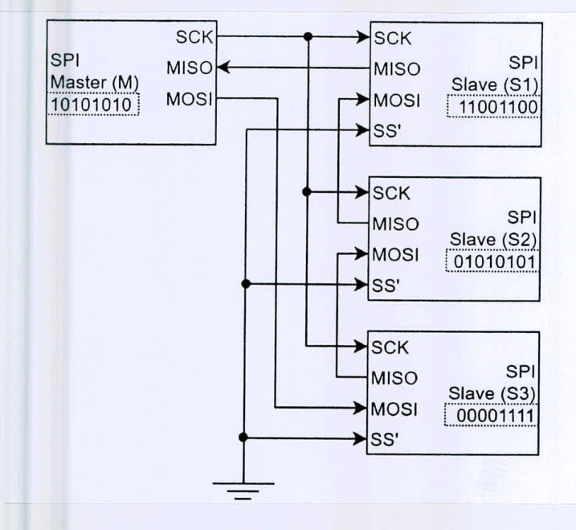

Three SPI Slaves (S1, S2, and S3) are connected to an SPI Master (M) as shown in Figure 2(c). Initially, each device has eight bits of data in its shift registers as shown in the corresponding dotted box. Each device is also configured to transmit the LSB first. Determine the contents of the shift registers of the four devices after

i. 4 clock pulses

ii. 16 clock pulses

*Figure 2(c), as read from the scan: Master M holds 10101010; Slave S1 holds 11001100, S2 holds 01010101, S3 holds 00001111. M's SCK goes to all three slaves and all three SS' inputs are tied to ground. The data lines form a daisy chain: M's MOSI goes to S3's MOSI, S3's MISO to S2's MOSI, S2's MISO to S1's MOSI, and S1's MISO back to M's MISO. Check the wiring against the figure.*
