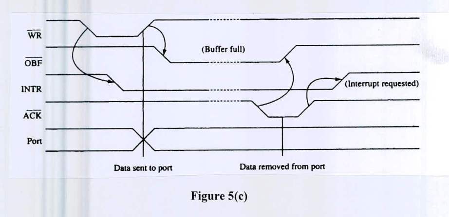

8255 can operate in three different modes. The timing diagram of one of the modes is given below in Figure 5(c).

Now answer the following:

i) Which mode of operation is related to the above timing diagram? What can be its possible application(s)?

ii) What are the input and output signals (to 8255) in the figure? How do the input signals control the output? You need to show it by pointing an arrow from a change in the input signal to the corresponding change in the output signal for all cases.
